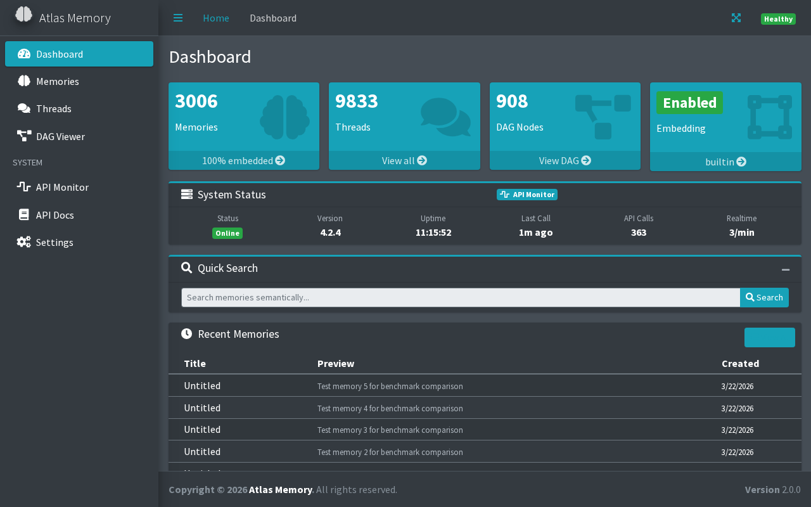
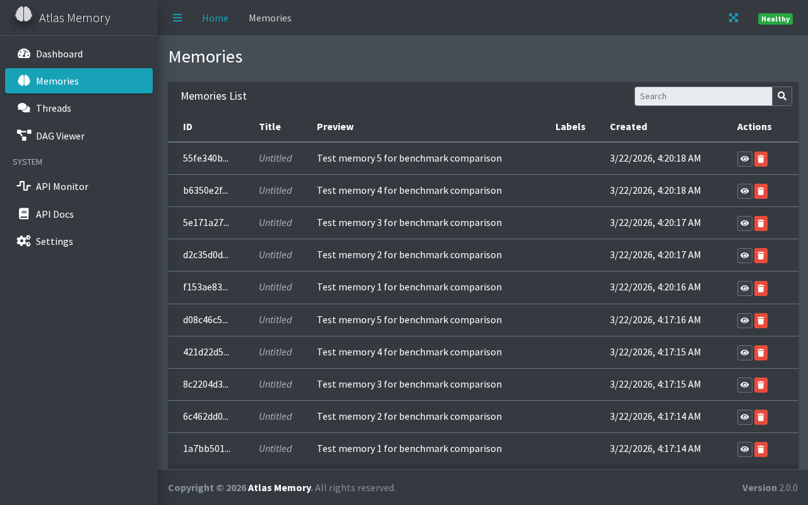
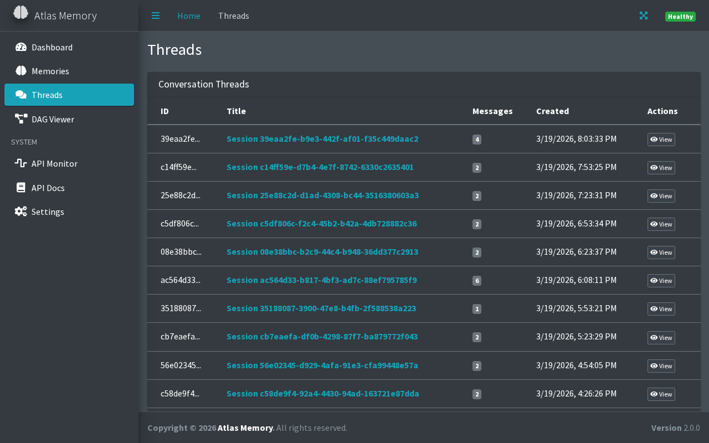
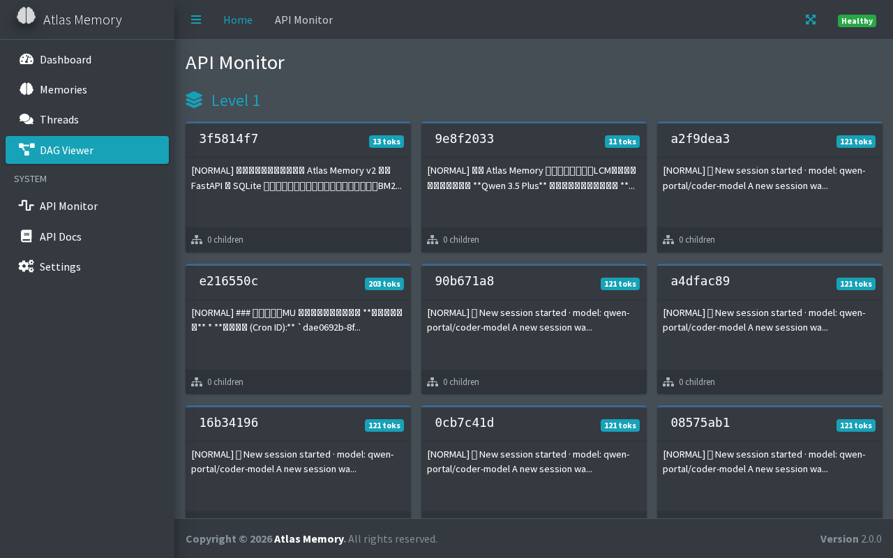
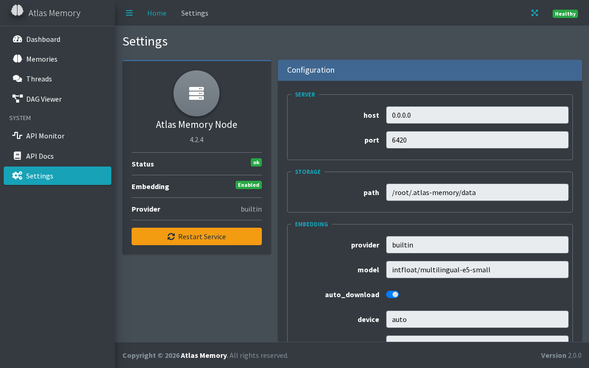

# Atlas Memory

### Give Your AI a Memory That Actually Works

> Self-hosted long-term memory for AI agents and chatbots.
> Download one file. Run it. Your AI remembers everything.


---

## The Problem

AI assistants forget everything between conversations. You tell ChatGPT your name, your preferences, your project details — and next session, it's gone. Context windows help, but they have limits. RAG systems are complex to set up and maintain.

## The Solution

Atlas Memory is a **single binary** you run on your machine. It gives any AI agent persistent, searchable long-term memory via a simple REST API.

```bash
# That's it. Download, run, done.
./atlas-memory --port 6420
```

Your AI stores memories. Your AI searches memories. You own your data. No cloud. No subscriptions. No PhD required.

---

## Screenshots

### Dashboard


### Memory Browser


### Conversation Threads


### API Monitor


### Settings


*Web GUI is embedded in the binary — no separate install needed. Just run and open your browser.*

---

## 30-Second Quick Start

```bash
# 1. Download
curl -L -o atlas-memory \
  https://github.com/dddabtc/atlas-memory-releases/releases/latest/download/atlas-memory-linux-x86_64
chmod +x atlas-memory

# 2. Run
./atlas-memory

# 3. Store a memory
curl -X POST localhost:6420/memories \
  -H 'Content-Type: application/json' \
  -d '{"content": "User prefers dark roast coffee with oat milk"}'

# 4. Search it later
curl -X POST localhost:6420/memories/search \
  -H 'Content-Type: application/json' \
  -d '{"query": "what coffee does the user like?"}'
```

That's it. No config files, no databases to set up, no Docker, no Python.

---

## How Good Is It?

We benchmark against every major memory system using standard academic tests.

### LongMemEval (499 questions)

| System | Score | Type |
|--------|-------|------|
| [HydraDB](https://hydradb.ai) | 90.79% | Closed source |
| **Atlas Memory** | **90.18%** | **Open / Self-hosted** |
| [Supermemory](https://github.com/supermemoryai/supermemory) | 85.20% | Open source |
| [Zep](https://github.com/getzep/zep) | 71.20% | Commercial |
| Full-context GPT-4o | 60.20% | LLM baseline |
| [Mem0](https://github.com/mem0ai/mem0) (open source) | 29.07% | Open source |

### LoCoMo (502 QA pairs — LLM-as-Judge)

| System | Score | Type |
|--------|-------|------|
| **Atlas Memory (enhanced)** | **87.05%** | **Open / Self-hosted** |
| **Atlas Memory (production)** | **74.70%** | **Open / Self-hosted** |
| Full-context (26k tokens) | 72.90% | LLM baseline |
| [Mem0ᵍ](https://github.com/mem0ai/mem0) (graph memory) | 68.44% | Open source |
| [Mem0](https://github.com/mem0ai/mem0) | 66.88% | Open source |
| [Zep](https://github.com/getzep/zep) | 65.99% | Commercial |
| RAG (best config, k=2) | 60.97% | Standard RAG |
| [LangMem](https://github.com/langchain-ai/langmem) | 58.10% | Open source |
| [OpenAI Memory](https://openai.com/index/memory-and-new-controls-for-chatgpt/) (ChatGPT) | 52.90% | Proprietary |
| [A-Mem](https://github.com/agentic-memory/a-mem) | 48.38% | Research |
| **Atlas Memory (standalone)** | **43.63%** | **No LLM required** |
| Atlas Memory (v2 baseline) | 29.90% | Legacy version |
| [OpenViking](https://github.com/volcengine/OpenViking) | 20.60% | Open source (ByteDance) |
| [LCM](https://papers.voltropy.com/LCM) | 14.50% | Research (Voltropy) |
| [Nowledge](https://nowledge.ai) | 0.40% | Commercial |

*Mem0/Zep/OpenAI/LangMem/A-Mem scores from the [Mem0 paper](https://arxiv.org/abs/2504.19413) (Khant et al., 2025). OpenViking/LCM/Nowledge scores from our [independent benchmark](https://github.com/dddabtc/lcm-prototype). Atlas scores from our own evaluation. All use LLM-as-Judge on the same LoCoMo QA pairs.*

### Atlas Memory — All Versions

| Version | LongMemEval | LoCoMo | What You Need |
|---------|-------------|--------|---------------|
| **Enhanced** | **90.18%** | **87.05%** | Gemini 2.5 Pro + enrichment pipeline |
| **Production** | — | **74.70%** | OpenAI gpt-4.1-mini + embeddings |
| **Standalone** | — | **43.63%** | Nothing — just the binary |

**#1 self-hosted memory system. #1 overall globally on LongMemEval** (v4.3.0, 90.18%).

---

## Who Is This For?

- **AI developers** building chatbots, assistants, or agents that need to remember users
- **Hobbyists** running local AI setups (Ollama, LM Studio, etc.) who want persistent memory
- **Teams** building internal AI tools that need conversation history
- **Privacy-conscious users** who want memory that stays on their machine
- **[OpenClaw](https://github.com/openclaw/openclaw) users** who want to upgrade their agent's memory (see integration guide below)

---

## Installation

### Linux (x86_64)

```bash
curl -L -o atlas-memory \
  https://github.com/dddabtc/atlas-memory-releases/releases/latest/download/atlas-memory-linux-x86_64
chmod +x atlas-memory
./atlas-memory
```

### Linux (ARM64 — Raspberry Pi, AWS Graviton)

```bash
curl -L -o atlas-memory \
  https://github.com/dddabtc/atlas-memory-releases/releases/latest/download/atlas-memory-linux-aarch64
chmod +x atlas-memory
./atlas-memory
```

### macOS (Apple Silicon — M1/M2/M3/M4)

```bash
curl -L -o atlas-memory \
  https://github.com/dddabtc/atlas-memory-releases/releases/latest/download/atlas-memory-macos-aarch64
chmod +x atlas-memory
./atlas-memory
```

### Windows

```powershell
# Download from https://github.com/dddabtc/atlas-memory-releases/releases/latest
.\atlas-memory-windows-x86_64.exe --port 6420
```

### Run as a Service (Linux)

```bash
sudo tee /etc/systemd/system/atlas-memory.service << 'EOF'
[Unit]
Description=Atlas Memory Server
After=network.target

[Service]
Type=simple
ExecStart=/usr/local/bin/atlas-memory --port 6420
WorkingDirectory=/var/lib/atlas-memory
Restart=always
RestartSec=5

[Install]
WantedBy=multi-user.target
EOF

sudo mkdir -p /var/lib/atlas-memory
sudo cp atlas-memory /usr/local/bin/
sudo systemctl enable --now atlas-memory
```

### Verify It's Running

```bash
curl http://localhost:6420/health
# → {"status":"ok","version":"4.2.4-rs","memory_count":0}
```

---

## Integrate with OpenClaw

[OpenClaw](https://github.com/openclaw/openclaw) is an open-source AI agent framework. Atlas Memory plugs in as its long-term memory backend.

### Step 1: Start Atlas Memory

```bash
./atlas-memory --port 6420
```

### Step 2: Configure OpenClaw

In your OpenClaw `config.yaml`, add the Atlas Memory provider:

```yaml
memory:
  provider: atlas
  atlas:
    url: http://localhost:6420
    # Or remote: http://your-server:6420
```

### Step 3: That's It

OpenClaw will automatically:
- Store conversation summaries and key facts to Atlas Memory
- Search relevant memories before each response
- Use `memory_search` tool to recall prior context

### How It Works with OpenClaw

```
User: "Remember I'm allergic to shellfish"
  ↓
OpenClaw stores → POST /memories {"content": "User is allergic to shellfish"}
  ↓
(days later)
User: "What should I order at this seafood restaurant?"
  ↓
OpenClaw searches → POST /memories/search {"query": "food allergies dietary restrictions"}
  ↓
Atlas returns → "User is allergic to shellfish"
  ↓
OpenClaw: "I'd recommend the grilled salmon — and I remember you're allergic to shellfish, so I'll avoid suggesting shrimp or crab dishes."
```

### Multi-Agent Setup

Run one Atlas Memory server, share it across multiple OpenClaw agents:

```yaml
# Agent 1 (personal assistant)
memory:
  provider: atlas
  atlas:
    url: http://192.168.1.100:6420

# Agent 2 (work assistant) — same server, different session_ids
memory:
  provider: atlas
  atlas:
    url: http://192.168.1.100:6420
```

Each agent uses `session_id` to keep their memories separate, or share memories across agents for team use.

---

## CLI Reference

```
atlas-memory [OPTIONS]

Options:
  -p, --port <PORT>      Server port [default: 6420]
  -H, --host <HOST>      Bind address [default: 0.0.0.0]
  -c, --config <FILE>    Path to config.yaml
  -d, --db <PATH>        Database file path [default: atlas_memory.db]
  -h, --help             Print help
  -V, --version          Print version
```

### Examples

```bash
# Default — just works
./atlas-memory

# Custom port
./atlas-memory --port 8080

# Production with config
./atlas-memory --config /etc/atlas-memory/config.yaml

# Multiple instances
./atlas-memory --port 6420 --db production.db &
./atlas-memory --port 6421 --db staging.db &
```

---

## API Reference

Base URL: `http://localhost:6420`

### At a Glance

| Method | Endpoint | Description |
|--------|----------|-------------|
| `GET` | `/health` | Server status |
| `POST` | `/memories` | Store a memory |
| `POST` | `/memories/search` | Search memories |
| `GET` | `/memories` | List all memories |
| `GET` | `/memories/{id}` | Get one memory |
| `PATCH` | `/memories/{id}` | Update a memory |
| `DELETE` | `/memories/{id}` | Delete a memory |
| `GET` | `/memories/stats` | Usage statistics |
| `POST` | `/memories/reindex` | Rebuild search index |
| `POST` | `/memories/distill` | Summarize a session |

### Store a Memory

```bash
curl -X POST localhost:6420/memories \
  -H 'Content-Type: application/json' \
  -d '{
    "content": "User prefers dark roast coffee with oat milk, no sugar.",
    "title": "Coffee preference",
    "session_id": "chat-2024-01-15",
    "labels": ["preference", "food"]
  }'
```

**Fields:**

| Field | Type | Required | Description |
|-------|------|----------|-------------|
| `content` | string | ✅ | The memory text |
| `title` | string | | Short label |
| `session_id` | string | | Group by conversation |
| `labels` | string[] | | Tags for filtering |

### Search Memories

```bash
curl -X POST localhost:6420/memories/search \
  -H 'Content-Type: application/json' \
  -d '{"query": "what coffee does the user like?", "limit": 5}'
```

**Fields:**

| Field | Type | Required | Description |
|-------|------|----------|-------------|
| `query` | string | ✅ | What to search for |
| `limit` | int | | Max results (default 10) |
| `labels` | string[] | | Filter by tags |
| `session_id` | string | | Filter by session |
| `threshold` | float | | Min similarity score |

**Response:**

```json
{
  "results": [
    {
      "id": "a1b2c3d4-...",
      "content": "User prefers dark roast coffee with oat milk, no sugar.",
      "score": 0.847,
      "title": "Coffee preference"
    }
  ]
}
```

### List Memories

```bash
curl 'localhost:6420/memories?limit=20&offset=0'
```

### Get / Update / Delete

```bash
# Get one memory
curl localhost:6420/memories/{id}

# Update
curl -X PATCH localhost:6420/memories/{id} \
  -H 'Content-Type: application/json' \
  -d '{"content": "Updated text", "labels": ["updated"]}'

# Delete
curl -X DELETE localhost:6420/memories/{id}
```

### Stats

```bash
curl localhost:6420/memories/stats
# → {"total_memories": 2994, "total_sessions": 42, "total_labels": 15, ...}
```

### Health Check

```bash
curl localhost:6420/health
# → {"status": "ok", "version": "4.2.4-rs", "memory_count": 2994}
```

---

## Integration Examples

### Python

```python
import requests

ATLAS = "http://localhost:6420"

# Store
requests.post(f"{ATLAS}/memories", json={
    "content": "User's birthday is March 15th",
    "labels": ["personal"]
})

# Search
results = requests.post(f"{ATLAS}/memories/search", json={
    "query": "when is the user's birthday?",
    "limit": 5
}).json()

for r in results["results"]:
    print(f"[{r['score']:.2f}] {r['content']}")
```

### JavaScript / Node.js

```javascript
const ATLAS = "http://localhost:6420";

// Store
await fetch(`${ATLAS}/memories`, {
  method: "POST",
  headers: { "Content-Type": "application/json" },
  body: JSON.stringify({ content: "User prefers dark mode" })
});

// Search
const { results } = await fetch(`${ATLAS}/memories/search`, {
  method: "POST",
  headers: { "Content-Type": "application/json" },
  body: JSON.stringify({ query: "UI preferences", limit: 5 })
}).then(r => r.json());
```

### curl Cheat Sheet

```bash
# Store       → POST /memories          + {"content": "..."}
# Search      → POST /memories/search   + {"query": "...", "limit": 5}
# List        → GET  /memories?limit=10&offset=0
# Get one     → GET  /memories/{id}
# Update      → PATCH /memories/{id}    + {"content": "..."}
# Delete      → DELETE /memories/{id}
# Stats       → GET  /memories/stats
# Health      → GET  /health
```

---

## Configuration

Atlas Memory works with **zero configuration**. For advanced setups, create `config.yaml`:

```yaml
server:
  host: 0.0.0.0
  port: 6420

database:
  path: atlas_memory.db

# Optional: better search with OpenAI embeddings
embedding:
  provider: openai
  openai_model: text-embedding-3-large
  openai_api_key: env:OPENAI_API_KEY

# Optional: LLM enrichment (entity extraction, query classification)
llm:
  providers:
    - name: openai
      model: gpt-4.1-mini
      api_key: env:OPENAI_API_KEY
    - name: ollama
      model: qwen3.5:9b
      base_url: http://localhost:11434
```

### Environment Variables

| Variable | Description |
|----------|-------------|
| `ATLAS_CONFIG` | Path to config.yaml |
| `ATLAS_PORT` | Override server port |
| `OPENAI_API_KEY` | For embeddings / LLM enrichment (optional) |

### Three Modes

| Mode | Requirements | Quality |
|------|-------------|---------|
| **Standalone** | Nothing (just the binary) | Good — token-overlap search |
| **With embeddings** | OpenAI API key | Better — semantic search |
| **Full enrichment** | OpenAI or Ollama | Best — entities, temporal reasoning, preferences |

---

## Benchmarks

Full results are in the [comparison tables above](#how-good-is-it). Summary:

| Benchmark | Best Score | Rank |
|-----------|-----------|------|
| **LongMemEval-s** (499 questions) | **90.18%** | **#1 globally (tied), #1 self-hosted** |
| LongMemEval-s Temporal | **94.74%** | 126/133 temporal questions |
| **LoCoMo** (502 questions) | **87.05%** | Enhanced pipeline |

### Per-Category Breakdown (LoCoMo, production mode)

| Category | Judge Score | Description |
|----------|-----------|-------------|
| Open-domain | 91.2% | General knowledge recall |
| Multi-hop | 90.6% | Reasoning across multiple memories |
| Single-hop | 83.8% | Direct fact retrieval |
| Temporal | 73.3% | Time-based reasoning ("last week") |
| Adversarial | 24.3% | Trick questions, false premises |

---

## FAQ

**Q: Do I need an OpenAI API key?**
No. Atlas Memory works standalone with zero external dependencies. An API key improves search quality (semantic embeddings vs token overlap) but is completely optional.

**Q: Where is my data stored?**
In a SQLite file (`atlas_memory.db`) in your working directory. It never leaves your machine.

**Q: Can I run this on a Raspberry Pi?**
Linux ARM64 build coming soon. The binary is lightweight (~12MB) and should work well on Pi 4+.

**Q: How many memories can it handle?**
Tested with 3,000+ memories. SQLite can handle millions. Search latency scales with data volume.

**Q: Is there a web UI?**
The web UI is embedded in the binary. Run it and open `http://localhost:6420` in your browser. Includes dashboard, memory browser, threads, DAG viewer, API monitor, and settings.

**Q: How is this different from Mem0?**
Atlas Memory scores 90.18% on LongMemEval vs Mem0's 29.07% — a 3x improvement. The key difference: Atlas preserves raw conversation data and enriches on top, while Mem0 compresses conversations into facts, losing context.

---

## Platform Support

| Platform | Status | Binary |
|----------|--------|--------|
| Linux x86_64 | ✅ Available | `atlas-memory-linux-x86_64` |
| Linux ARM64 (Pi, Graviton) | ✅ Available | `atlas-memory-linux-aarch64` |
| macOS ARM64 (Apple Silicon) | ✅ Available | `atlas-memory-macos-aarch64` |
| Windows x86_64 | ✅ Available | `atlas-memory-windows-x86_64.exe` |

[**→ Download latest release**](https://github.com/dddabtc/atlas-memory-releases/releases/latest)

---

## License

MIT — use it however you want.

---

**Built with 🦀 Rust. Benchmarked against the best. Self-hosted forever.**

